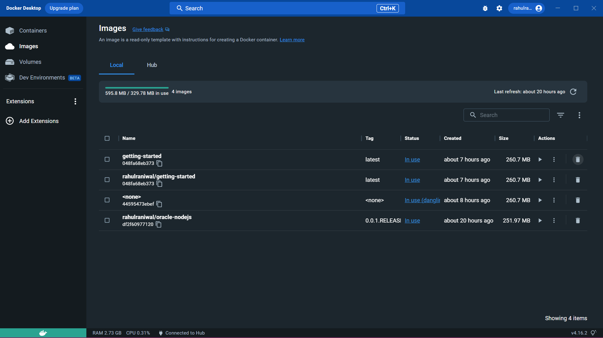
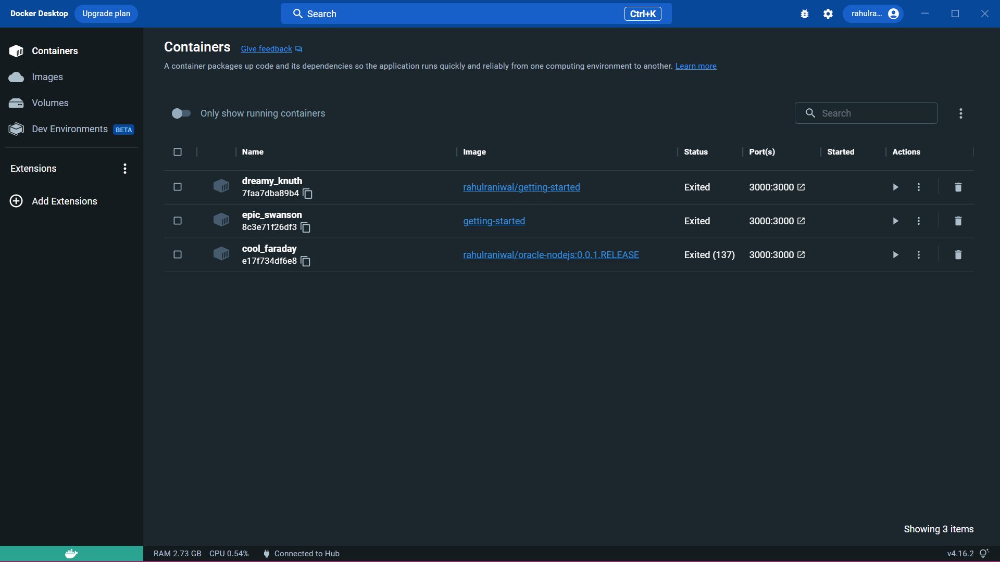
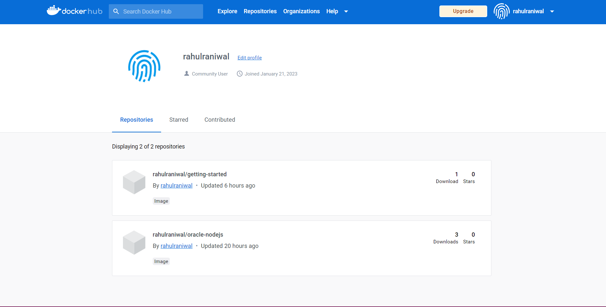

# Oracle Technical Assessment
This is the task assigned to the shortlisted candidate for next round of Oracle opportunity.

## **Task Assigned to me**
My task is to download and run a simple application in a docker container.

## **How I approached It**
The first action I take is to install Docker on my desktop and get acquainted with it. I learned a few commands and learned about Docker images and containers.

## **Procedure that I followed**
After understanding the basic commands and components, I began to package the simple nodejs application into a container and The sample application that is documented in the documentation. By using a code editor and a terminal on the desktop.
I composed the image using a Dockerfile and created a repository and push to my account so that others can utilize it as a template for Docker containers.

## **What problem I faced**
During the installation process of Docker, there were a few errors that indicated in my system like docker was not running, so I followed the documentation to resolve my issue. 
During the process of learning, some basic commands and information regarding dockerfile, images, and container documentation are extremely helpful. The documentation is well organized and informative, which is beneficial for a basic understanding of each term in the commands and other components of the docker.

## **What I have learned from this exercise**
In the given exercise, I learned about Docker and how to use Docker to containerize any project, making it independent of the system.
## **Some Examples of how docker might be helpful in deploying application**

### 1. Simplifying Configuration
Docker provides the ability to run any platform with its own configuration on top of any infrastructure without the overhead of a virtual machine.

### 2. Developer Productivity
For developer productivity we want the development environment to be as close as possible to production and secondly, we want the development environment to be as fast as possible.
### 3. App Isolation
Each container is well isolated form each other.
### 4. Code Pipeline Management
Code travels from the developer’s machine to production,Each of these may have minor differences along the way.
Docker provides a consistent environment for the application from developer through production, easing the code development and deployment pipeline.
### 5. Rapid Deployment
Docker containers can be created and up very fast and easily.

---

## [Docker Profile](https://hub.docker.com/u/rahulraniwal)

--- 

---

---

---
