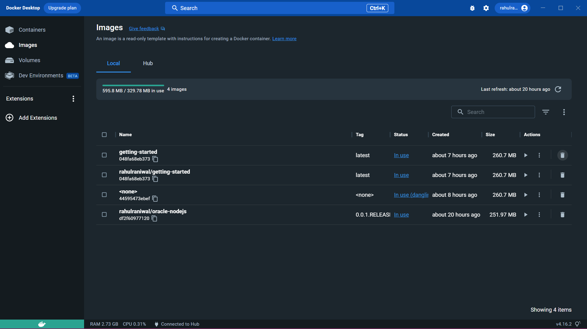
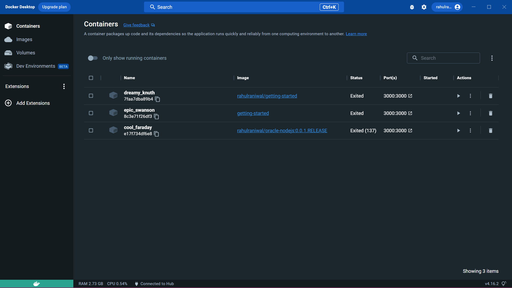

# Oracle Technical Assessment
This is the task assigned to the shortlisted candidate for next round of technical assessment.

## **Task Assigned to me**
My task is to download and run a simple application in a docker container

## **How I approached It**
The first action I take is to install Docker on my desktop and get acquainted with it. I learned a few commands and learned about Docker images and containers.

## **Procedure that I followed**
After understanding the basic commands and components, I began to package the simple nodejs application into a container and The sample application is documented in the documentation. By using a code editor and a terminal on the desktop.
I composed the image using a Dockerfile and created a repository and push to my account so that others can utilize it as a template for Docker containers.

## **What problem I faced**
During the installation process of Docker, there were a few errors that indicated my system was incompatible, so I followed some tutorials to help me. 
During the process of learning, some basic commands and information regarding dockerfile, images, and container documentation are extremely helpful. The documentation is well organized and informative, which is beneficial for a basic understanding of each term in the commands and other components of the docker.

## **Some Examples of how docker might be helpful in deploying application**

### 1. Simplifying Configuration
### 2. Developer Productivity
### 3. App Isolation
### 4. Code Pipeline Management
### 5. Rapid Deployment

---

## [Docker Profile](https://hub.docker.com/u/rahulraniwal)

---

---

